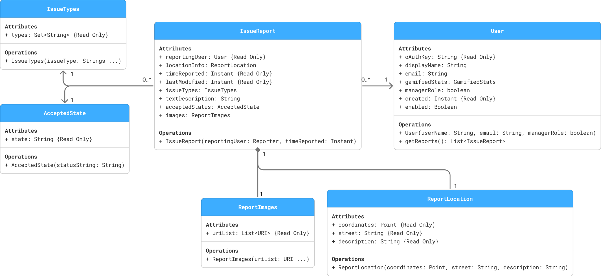



## Page contents
{:.no_toc:}

- ToC
{:toc}

## UML class diagram

## Entity-relationship diagram

## DDL



## Entity classes

The following JPA entity classes correspond to the tables shown in the ERD.

- [AcceptedState](https://github.com/dd-java-22/capstone/blob/main/server/src/main/java/edu/cnm/deepdive/seesomethingabq/model/entity/AcceptedState.java)
- [IssueReport](https://github.com/dd-java-22/capstone/blob/main/server/src/main/java/edu/cnm/deepdive/seesomethingabq/model/entity/IssueReport.java)
- [IssueType](https://github.com/dd-java-22/capstone/blob/main/server/src/main/java/edu/cnm/deepdive/seesomethingabq/model/entity/IssueType.java)
- [ReportImage](https://github.com/dd-java-22/capstone/blob/main/server/src/main/java/edu/cnm/deepdive/seesomethingabq/model/entity/ReportImage.java)
- [ReportLocation](https://github.com/dd-java-22/capstone/blob/main/server/src/main/java/edu/cnm/deepdive/seesomethingabq/model/entity/ReportLocation.java)
- [UserProfile](https://github.com/dd-java-22/capstone/blob/main/server/src/main/java/edu/cnm/deepdive/seesomethingabq/model/entity/UserProfile.java)

### Repository interface

- [AcceptedStateRepository](https://github.com/dd-java-22/capstone/blob/main/server/src/main/java/edu/cnm/deepdive/seesomethingabq/service/repository/AcceptedStateRepository.java)
- [IssueReportRepository](https://github.com/dd-java-22/capstone/blob/main/server/src/main/java/edu/cnm/deepdive/seesomethingabq/service/repository/IssueReportRepository.java)
- [IssueTypeRepository](https://github.com/dd-java-22/capstone/blob/main/server/src/main/java/edu/cnm/deepdive/seesomethingabq/service/repository/IssueTypeRepository.java)
- [ReportImageRepository](https://github.com/dd-java-22/capstone/blob/main/server/src/main/java/edu/cnm/deepdive/seesomethingabq/service/repository/ReportImageRepository.java)
- [ReportLocationRepository](https://github.com/dd-java-22/capstone/blob/main/server/src/main/java/edu/cnm/deepdive/seesomethingabq/service/repository/ReportLocationRepository.java)
- [UserProfileRepository](https://github.com/dd-java-22/capstone/blob/main/server/src/main/java/edu/cnm/deepdive/seesomethingabq/service/repository/UserProfileRepository.java)

### Controller classes

- [UserController](https://github.com/dd-java-22/capstone/blob/main/server/src/main/java/edu/cnm/deepdive/seesomethingabq/controller/UserController.java)

### Service 

- [UserService](https://github.com/dd-java-22/capstone/blob/main/server/src/main/java/edu/cnm/deepdive/seesomethingabq/service/UserService.java)
- [UserServiceImpl](https://github.com/dd-java-22/capstone/blob/main/server/src/main/java/edu/cnm/deepdive/seesomethingabq/service/UserServiceImpl.java)
- [JwtConverter](https://github.com/dd-java-22/capstone/blob/main/server/src/main/java/edu/cnm/deepdive/seesomethingabq/service/JwtConverter.java)
